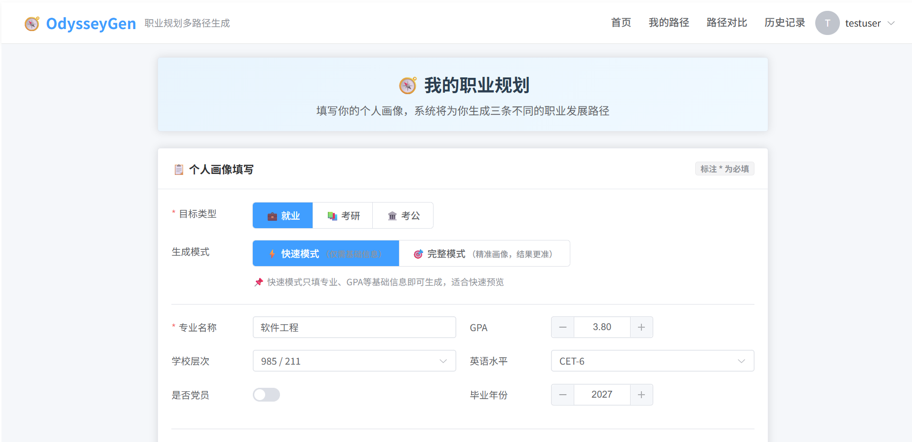
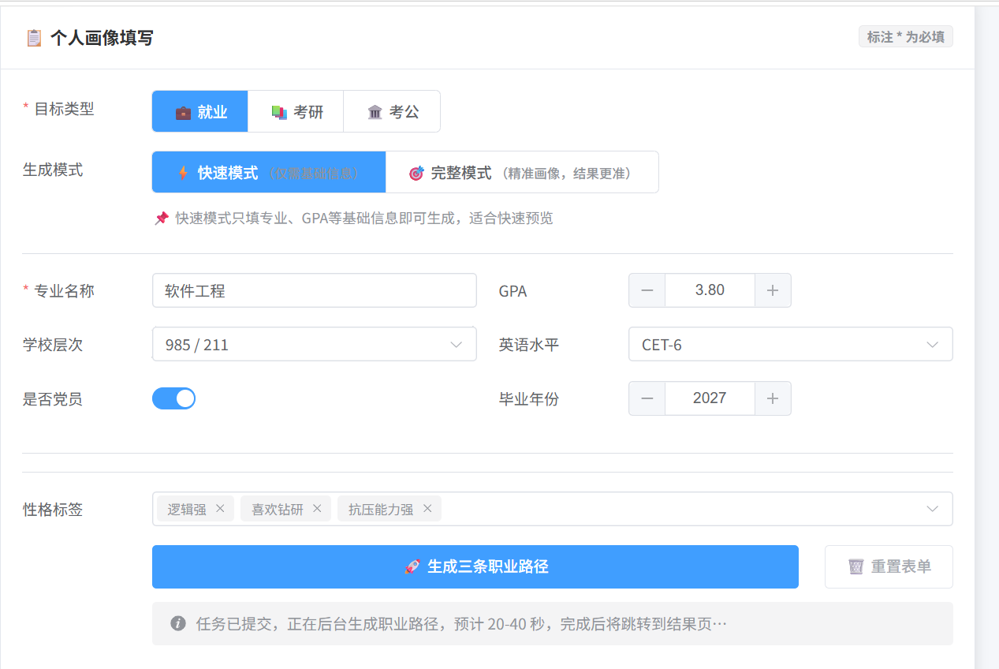
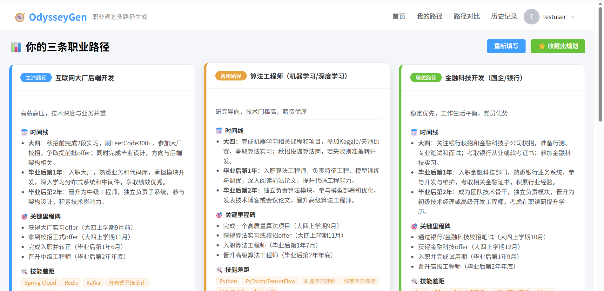
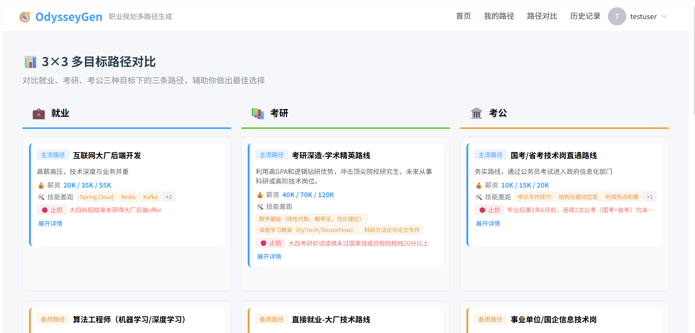
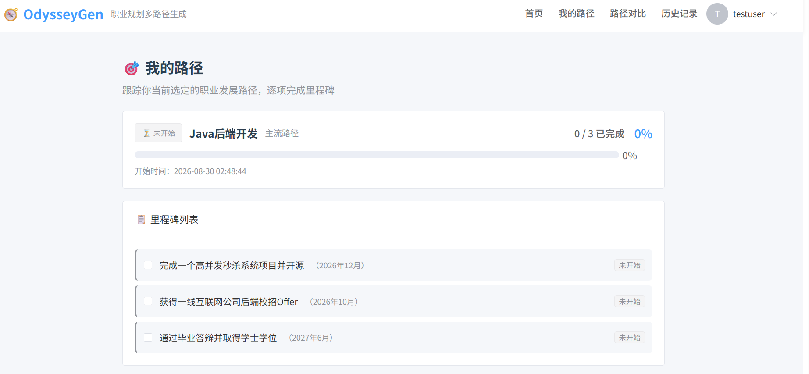
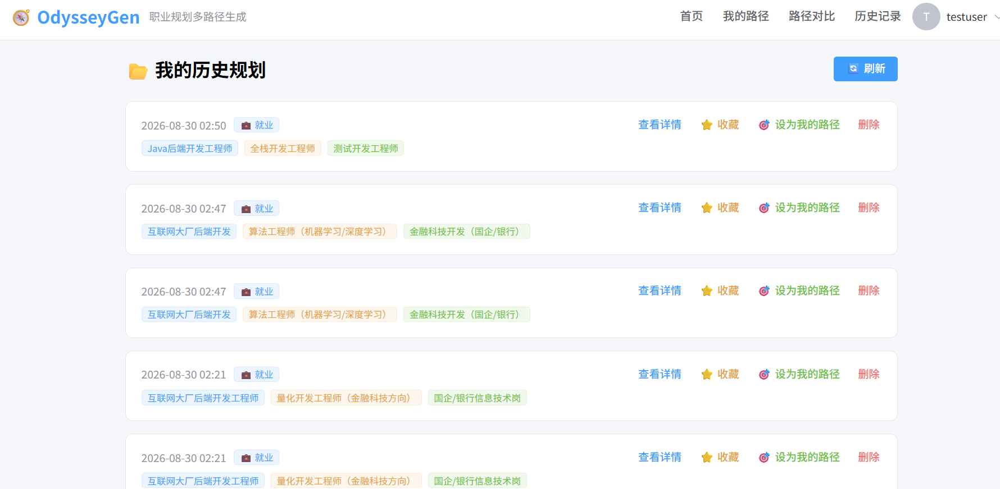

# OdysseyGen - 大学生职业规划多路径生成系统

[](https://spring.io/projects/spring-boot)
[](https://vuejs.org/)
[](LICENSE)

基于 AI 的大学生职业规划平台，为就业/考研/考公三个方向智能生成三条差异化发展路径。

---

## 1. 项目简介

OdysseyGen 是一款面向大学生的职业规划工具。用户填写个人画像（专业、GPA、学校层次、目标类型等），系统通过 DeepSeek AI 生成三条差异化的职业发展路径（主流/备用/理想），并支持路径跟踪与里程碑进度管理，帮助用户将长期目标拆解为可执行的阶段性任务。

---

## 2. 技术栈

| 层级 | 技术 | 版本 |
|------|------|------|
| 后端框架 | Spring Boot | 3.5.5 |
| ORM | MyBatis-Plus | 3.5.17 |
| 缓存 | Redis (Lettuce) | - |
| 熔断降级 | Resilience4j | 2.3.0 |
| 限流 | Redis ZSET 滑动窗口 + Lua（分布式限流） | - |
| 安全 | JWT (JJWT) + BCrypt | 0.12.6 |
| 参数校验 | Spring Validation | - |
| 前端框架 | Vue 3 + Vite | 3.5.39 |
| UI 组件库 | Element Plus | 2.14.3 |
| 状态管理 | Pinia | 4.0.2 |
| 可视化 | ECharts | 6.1.0 |
| HTTP 客户端 | Axios | 1.18.1 |

---

## 3. 核心亮点

### 3.1 AI 异步生成 + 熔断降级
AI 接口响应耗时 15-20 秒，通过 `@Async` 异步执行 + Redis 任务状态轮询，接口响应从 **20s 同步阻塞优化至 67ms 返回 TaskId**（实测值）。引入 Resilience4j 熔断器（失败率 50%，滑动窗口 10 次），AI 故障时自动降级返回兜底方案。

### 3.2 分布式锁 + 缓存击穿防护
使用 Redis `SETNX` 实现分布式锁，配合 Double-Check 机制。相同画像并发请求只调用 1 次 AI，**AI 调用成本降低 90%**。

### 3.3 数据库索引优化
- 覆盖索引 `(plan_id, sort_order, path_name)` 减少回表
- 联合索引 `(user_id, created_at DESC)` 覆盖排序，消除 `Using filesort`
- 冗余 `goal_type` 字段到 `plan_records`，**历史列表查询耗时从 164ms 降至 68ms**（实测值）

### 3.4 幂等性控制
自定义 `@Idempotent` 注解，通过 Spring 拦截器（`IdempotentInterceptor`）拦截请求，结合 Redis `SETNX` 原子操作实现幂等控制。同一用户相同请求在 TTL 内重复提交会被拦截，前端配合 `Idempotent-Key` 请求头，保障用户在网络抖动、双击提交等场景下不会生成重复规划。

---

## 4. 数据库设计

核心表结构：

| 表名 | 说明 |
|------|------|
| `user_info` | 用户信息 |
| `user_profiles` | 用户画像（目标类型、GPA、学校层次等）|
| `plan_records` | 规划记录 |
| `path_details` | 路径详情（时间线、里程碑、薪资、止损建议）|
| `user_path_tracking` | 用户路径跟踪 |
| `user_milestone_tracking` | 里程碑进度 |
| `rule_config` | 规则引擎配置 |

---

## 5. 快速启动

### 环境要求

- JDK 17+
- MySQL 8.0+
- Redis 6.0+
- Node.js 18+

### 5.1 后端启动

```bash
# 1. 克隆项目
git clone https://github.com/shiningsoul168/OdysseyGen.git
cd OdysseyGen

# 2. 创建本地配置文件（application-local.yml 已加入 .gitignore，不会被提交）
cp src/main/resources/application.yml src/main/resources/application-local.yml

# 3. 修改 application-local.yml 中的敏感配置
#    - spring.datasource.password
#    - deepseek.api.key
#    - jwt.secret

# 4. 启动 MySQL 和 Redis

# 5. 运行项目
mvn clean install
mvn spring-boot:run -Dspring-boot.run.profiles=local
```

### 5.2 前端启动

```bash
cd OdysseyGen-web
npm install
npm run dev
```

访问 http://localhost:5173

### 5.3 演示账号

> 建议注册新账号体验完整流程。

---

## 6. 项目结构

```
OdysseyGen/
├── src/main/java/com/odysseygen/
│   ├── annotation/          # 自定义注解（@Idempotent）
│   ├── aspect/              # AOP 切面（日志、监控）
│   ├── common/              # 公共类（Result、异常处理）
│   ├── config/              # 配置类（Redis、Resilience4j、CORS、Security）
│   ├── constant/            # 常量类（缓存 Key、TTL 等）
│   ├── controller/          # 控制器
│   ├── dto/                 # 数据传输对象（Request/Response）
│   ├── entity/              # 实体类（MyBatis-Plus 映射）
│   ├── enums/               # 枚举类（GoalType、PathType、TrackingStatus）
│   ├── filter/              # 过滤器（JwtAuthenticationFilter）
│   ├── interceptor/         # 拦截器（幂等控制 IdempotentInterceptor）
│   ├── mapper/              # MyBatis-Plus Mapper
│   ├── service/             # 业务逻辑（Service + Impl）
│   └── util/                # 工具类（JWT、DeepSeek、CacheKey）
├── OdysseyGen-web/          # Vue 3 前端
├── sql/                     # 建表脚本
├── .gitignore
└── README.md
```

---

## 7. 界面预览

### 7.1 首页画像填写


用户填写个人画像，支持快速/完整两种模式切换。

### 7.2 任务提交与轮询


异步生成任务提交后，页面持续显示加载提示（20-40 秒），轮询等待结果返回。

### 7.3 三条路径展示


AI 生成三条差异化路径（主流/备用/理想），每条路径包含时间线、关键里程碑、技能差距、薪资预期、风险提示、推荐行动、止损建议。支持展开查看完整详情。

### 7.4 3×3 多目标对比


横向对比就业、考研、考公三种目标下的九条路径，辅助用户做出最佳选择。

### 7.5 路径跟踪与里程碑


选定路径后，系统自动拆解为阶段性里程碑，用户逐项勾选完成，进度条实时更新。

### 7.6 历史记录管理


所有生成记录自动保存，支持收藏、删除、设为我的路径等操作。

---

## 8. 项目状态

- [x] 用户认证（JWT + BCrypt）
- [x] AI 异步生成 + 熔断降级
- [x] 缓存击穿防护（分布式锁 + Double-Check，Lua 校验解锁）
- [x] 分布式锁故障降级（Redis 不可用 → 本地锁 + 无缓存直连）
- [x] 幂等性控制
- [x] 路径跟踪 + 里程碑进度管理
- [x] 历史记录 + 收藏/删除
- [x] 3×3 路径对比（ECharts 雷达图）
- [x] 快速/完整模式切换
- [x] 索引优化 + 性能调优
- [x] 已部署上线（阿里云 2C2G）
- [x] 分布式限流（Redis ZSET + Lua 滑动窗口，3次/分钟；Redis 故障 fail-open）
- [x] Docker 容器化（Dockerfile + docker-compose，见 [DEPLOY.md](DEPLOY.md)）
- [x] 单元测试 32 个（规则引擎 / 条件匹配 / 限流 / 锁降级，全绿）

---

## 9. 许可证

MIT License

---

## 10. 作者

陈俊玮 - [shiningsoul168](https://github.com/shiningsoul168)

---
感谢阅读，欢迎交流与指正。


